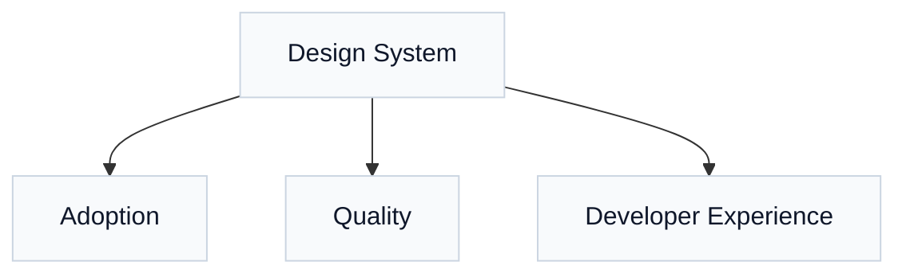

# Mastering Figma Design Systems: A Comprehensive Guide to Building Scalable, Future-Ready Design Solutions


_Caption: Strategy → Tokens → Components → Patterns → Templates → Code, guided by five pillars._

_Transform your design workflow with battle-tested strategies for creating robust design systems in Figma_

---

## Introduction: The Design System Revolution

In today's fast-paced digital landscape, the difference between successful products and forgotten failures often lies in the consistency and scalability of their design systems. As teams grow and products evolve, the need for a unified design language becomes not just beneficial—it becomes essential for survival.

Figma has emerged as the leading platform for collaborative design, and with it, the opportunity to build design systems that truly scale. But creating an effective design system in Figma isn't just about organizing components in neat folders. It's about establishing a living, breathing ecosystem that empowers teams, accelerates development, and ensures consistent user experiences across every touchpoint.


---

## Chapter 1: The Foundation - Understanding Design Systems in the Figma Era

### What Makes a Design System Truly Effective?

A design system is far more than a collection of UI components. It's a single source of truth that encompasses:

- **Visual Language**: Colors, typography, spacing, and iconography
- **Component Library**: Reusable UI elements with defined behaviors
- **Pattern Documentation**: Usage guidelines and interaction principles
- **Design Tokens**: The atomic elements that ensure consistency across platforms
- **Governance Model**: Processes for maintenance, updates, and evolution

### The Figma Advantage: Why Platform Choice Matters

Figma's real-time collaboration capabilities have revolutionized how teams approach design systems. Unlike traditional tools, Figma offers:

1. **Live Collaboration**: Multiple designers can work simultaneously without version conflicts
2. **Component Instances**: True component-instance relationships that propagate changes automatically
3. **Auto Layout**: Responsive design capabilities built into the platform
4. **Variables & Modes**: Advanced theming and token management
5. **Plugin Ecosystem**: Extensibility for specialized workflows


---

## Chapter 2: Architecture - Building Your Design System Foundation

### The Strategic Foundation: A Systematic Approach

Before diving into component creation, successful design systems require a strategic foundation that aligns with business objectives and technical requirements. This systematic approach ensures scalability and long-term success.

#### 1. Strategy Definition Phase

The foundation of any successful design system starts with clear strategic alignment:

**Clarify Objectives:**

- Define the business problems your design system will solve
- Establish success metrics and KPIs
- Align stakeholder expectations across design, development, and product teams
- Set realistic timelines and resource allocation

**Define Scope:**

- Identify which products and platforms will use the system
- Determine the breadth of components needed initially vs. future expansion
- Plan for multi-brand or white-label requirements
- Consider technical constraints and integrations

### The Hierarchical Structure: From Atoms to Ecosystems

Building on Brad Frost's Atomic Design methodology and adapted for modern Figma capabilities, the optimal structure follows this enhanced hierarchy:

#### 1. Design Tokens (Subatomic Level)

```
Design Tokens/
├── Colors/
│   ├── Primitives (Brand colors, neutrals)
│   ├── Semantic (Success, warning, error)
│   └── Component-specific (Button colors, text colors)
├── Typography/
│   ├── Font families
│   ├── Font weights
│   └── Line heights
├── Spacing/
│   └── Scale system (4px, 8px, 16px, 24px, 32px...)
├── Icon/Border/
│   ├── Icon families and styles
│   ├── Border radius tokens
│   └── Border width specifications
└── Effects/
    ├── Shadows (Elevation system)
    ├── Blur effects
    └── Animations
```


#### 2. Atoms (Basic Components)

The atomic level includes fundamental UI elements that serve as building blocks:

- **Select**:Options
- **Links**: Internal and external
- **Basic Inputs**: Text fields, checkboxes, radio buttons
- **Buttons**: Primary, secondary, tertiary variations


#### 3. Molecules (Component Groups)

- **Form groups**: Input + label + help text + validation
- **Navigation items**: Link + icon + badge combinations
- **Card components**: Image + title + description + actions
- **Button groups**: Primary + secondary action combinations
- **List items**: Content + metadata + interactive elements
- **Teaser components**: Preview content with call-to-action


#### 4. Organisms (Complex Components)

- **Headers**: Branding + navigation + user controls
- **Forms**: Complete form layouts with validation
- **Product displays**: Product grids, lists, and detail views
- **Navigation bars**: Primary and secondary navigation systems
- **Footers**: Site map + legal + social + contact information
- **News sections**: Article lists, featured content, categories
- **Search components**: Search inputs + filters + results
- **Article layouts**: Content structure + metadata + sharing


#### 5. Templates & Pages

- Page layouts
- Grid systems
- Application shells


### File Organization Strategy

The most successful design systems in Figma follow a modular file structure:

```
📁 [Company] Design System/
├── 🎨 Foundation
│   ├── Design Tokens
│   ├── Grid & Layout
│   └── Brand Guidelines
├── 🧩 Components
│   ├── Core Components
│   ├── Layout Components
│   └── Specialized Components
├── 📐 Templates
│   ├── Page Templates
│   ├── Email Templates
│   └── Marketing Templates
├── 🎯 Patterns
│   ├── Navigation Patterns
│   ├── Form Patterns
│   └── Data Display Patterns
└── 📚 Documentation
    ├── Usage Guidelines
    ├── Do's & Don'ts
    └── Release Notes
```

## Chapter 3: Component Mastery - Creating Bulletproof Design Elements

### The Anatomy of a Perfect Figma Component

Creating components that stand the test of time requires understanding several key principles:

#### 1. Prop-Based Flexibility

Modern Figma components should leverage the full power of component properties:

- **Boolean Properties**: Show/hide elements (badges, icons, labels)
- **Instance Swap Properties**: Swap icons, avatars, or sub-components
- **Text Properties**: Editable text content
- **Variant Properties**: Different visual states or sizes

```
Button Component Properties:
├── Size: Small | Medium | Large
├── State: Default | Hover | Active | Disabled
├── Type: Primary | Secondary | Ghost | Destructive
├── Icon: Boolean (show/hide)
├── Icon Position: Leading | Trailing
├── Label: Text Property
└── Loading: Boolean
```

#### 2. Auto Layout Mastery

Auto Layout is the secret weapon for creating truly responsive components. Best practices include:

- **Consistent Padding**: Use your spacing tokens religiously
- **Smart Constraints**: Understand when to use "Fill container" vs. "Hug contents"
- **Nested Auto Layout**: Create complex layouts with multiple auto layout containers
- **Direction Control**: Know when to stack horizontally vs. vertically

#### 3. State Management

Every interactive component should clearly define its states:

- **Rest State**: The default appearance
- **Hover State**: Feedback for mouse interaction
- **Active/Pressed State**: Click feedback
- **Focus State**: Keyboard navigation support
- **Disabled State**: Non-interactive appearance
- **Loading State**: For async operations
- **Error State**: For form validation

---

## Chapter 4: Advanced Techniques - Leveraging Figma's Power Features

### Variables and Modes: The Game Changer

Figma's variables feature has revolutionized design system management. Here's how to leverage them effectively:

#### Color Variables Strategy

```
Color Variables Structure:
├── Primitives/
│   ├── Blue-50 through Blue-900
│   ├── Gray-50 through Gray-900
│   └── Red-50 through Red-900
├── Semantic/
│   ├── Primary (→ Blue-600)
│   ├── Secondary (→ Gray-600)
│   ├── Success (→ Green-600)
│   └── Error (→ Red-600)
└── Component/
    ├── Button-Primary-BG (→ Primary)
    ├── Button-Primary-Text (→ White)
    └── Text-Body (→ Gray-800)
```

#### Multi-Mode Support

- **Light/Dark Modes**: Essential for modern applications
- **High Contrast Mode**: Accessibility compliance
- **Brand Variations**: Supporting multiple sub-brands
- **Platform Modes**: iOS vs Android vs Web variations


### Component Architecture Patterns

#### 1. The Slot Pattern

Create flexible layouts using the slot pattern:

```
Card Component:
├── Header Slot (Instance Swap)
├── Content Slot (Instance Swap)
└── Footer Slot (Instance Swap)
```

This allows infinite flexibility while maintaining consistency.

#### 2. The Composition Pattern

Build complex components by combining simpler ones:

```
Navigation Item:
├── Icon (Icon Component)
├── Label (Typography Component)
├── Badge (Badge Component - Optional)
└── Chevron (Icon Component - Optional)
```

#### 3. The Template Pattern

Create page-level components that teams can customize:

```
Article Template:
├── Header Section
├── Sidebar Navigation
├── Main Content Area
└── Related Articles Section
```

---

## Chapter 5: Collaboration Excellence - Making Design Systems Social

### Documentation as a First-Class Citizen

The best design systems treat documentation not as an afterthought, but as a core feature. In Figma, this means:

#### Component Documentation Standards

Every component should include:

- **Purpose**: What problem does this component solve?
- **Usage Guidelines**: When and where to use it
- **Anatomy Breakdown**: What are the component's parts?
- **Behavior Specifications**: How does it respond to interaction?
- **Accessibility Notes**: Screen reader support, keyboard navigation
- **Do's and Don'ts**: Visual examples of proper usage


#### Version Control and Change Management

Implement a robust change management process:

1. **Semantic Versioning**: Major.Minor.Patch (2.1.3)
2. **Change Logs**: Document what changed in each release
3. **Migration Guides**: Help teams adapt to breaking changes
4. **Deprecation Warnings**: Give teams time to transition
5. **Rollback Plans**: Be prepared to revert problematic changes

### Team Workflows and Governance

#### The Hub and Spoke Model

- **Design System Team**: Core maintainers and decision makers
- **Component Contributors**: Domain experts who propose new components
- **Component Consumers**: Designers and developers using the system

#### Contribution Process

1. **RFC (Request for Comments)**: Propose new components or changes
2. **Design Review**: Validate against system principles
3. **Prototype Phase**: Build and test the component
4. **Documentation**: Create usage guidelines
5. **Release**: Announce and distribute the change
6. **Adoption Support**: Help teams implement the changes


---

## Chapter 6: Performance and Scalability - Building for the Future

### Component Performance Optimization

As design systems grow, performance becomes critical:

#### File Organization for Speed

- **Lazy Loading**: Only load components when needed
- **File Splitting**: Separate rarely-used components
- **Image Optimization**: Use appropriate formats and resolutions
- **Instance Cleanup**: Remove unused component instances

#### Memory Management

Large design systems can consume significant memory:

- **Component Complexity**: Simplify overly complex components
- **Effect Usage**: Minimize expensive effects like blurs and shadows
- **Image Assets**: Optimize and compress images
- **Auto Layout Nesting**: Avoid excessive nesting levels

### Scalability Strategies

#### Modular Architecture

Design your system to scale across:

- **Multiple Products**: Shared components with product-specific variants
- **Different Platforms**: Web, mobile, desktop applications
- **Various Teams**: Different skill levels and design maturity
- **Global Markets**: Internationalization and localization support

#### API-First Thinking

Even though Figma is a visual tool, thinking in API terms helps:

- **Component Contracts**: Clearly defined props and behaviors
- **Backward Compatibility**: Changes that don't break existing usage
- **Forward Compatibility**: Designs that can evolve gracefully
- **Integration Points**: How components connect with development


---

## Chapter 7: Developer Handoff - Bridging Design and Development

### Design-to-Code Optimization

The best design systems bridge the gap between design and development seamlessly:


#### Token-Based Approach

Structure your design tokens to match development needs:

```css
/* CSS Custom Properties Generated from Figma Variables */
:root {
  --color-primary-50: #eff6ff;
  --color-primary-500: #3b82f6;
  --color-primary-900: #1e3a8a;

  --space-xs: 0.25rem;
  --space-sm: 0.5rem;
  --space-md: 1rem;

  --font-size-sm: 0.875rem;
  --font-size-base: 1rem;
  --font-size-lg: 1.125rem;
}
```

#### Component Specifications

Each component should include development-friendly specs:

- **HTML Structure**: Semantic markup guidelines
- **CSS Classes**: BEM methodology or utility class usage
- **JavaScript Behavior**: Event handling and state management
- **Accessibility Requirements**: ARIA labels, keyboard support
- **Performance Notes**: Lazy loading, optimization techniques

### Plugin Ecosystem Integration

Leverage Figma's plugin ecosystem for better handoff:

#### Design-to-Code Plugins

- **Figma to Code**: Generate React, Vue, or HTML components
- **Figma to Flutter**: For mobile development
- **Style Dictionary**: Export design tokens to multiple formats
- **Figma Tokens**: Advanced token management

#### Quality Assurance Plugins

- **Design Lint**: Automated design system compliance checking
- **Stark**: Accessibility validation and contrast checking
- **Figma to Zeplin**: Advanced specs and asset export


_Caption: Align tokens and specs with engineering via plugins, exports, and Storybook._


_Caption: Export variables → transform with build tools → deliver platform tokens for code._

---

## Chapter 8: Accessibility and Inclusive Design

### Building Accessibility into Your Design System

Accessibility should not be an afterthought—it should be baked into every component from day one.

#### Color and Contrast Standards

- **WCAG Compliance**: Minimum contrast ratios (4.5:1 for normal text, 3:1 for large text)
- **Color Independence**: Never rely solely on color to convey information
- **Focus Indicators**: Clear visual focus states for keyboard navigation
- **High Contrast Mode**: Ensure components work in high contrast environments

#### Typography Accessibility

- **Readable Font Sizes**: Minimum 16px for body text
- **Line Height**: 1.5x font size for optimal readability
- **Font Choice**: Prioritize legibility over style
- **Responsive Typography**: Scale appropriately across devices

#### Interactive Element Standards

- **Touch Targets**: Minimum 44px × 44px for mobile interfaces
- **Keyboard Navigation**: Logical tab order and clear focus states
- **Screen Reader Support**: Proper labeling and descriptions
- **Motion Sensitivity**: Respect users' motion preferences


### Inclusive Design Principles

#### Global Considerations

- **Right-to-Left (RTL) Support**: Design components that work in both directions
- **Cultural Sensitivity**: Colors, imagery, and iconography that work globally
- **Bandwidth Considerations**: Optimize for slower internet connections
- **Device Diversity**: Support both high-end and budget devices

#### Testing and Validation

Regular accessibility testing should include:

- **Automated Testing**: Use tools like axe-core for basic compliance
- **Screen Reader Testing**: Test with actual assistive technology
- **Keyboard-Only Navigation**: Ensure full functionality without a mouse
- **User Testing**: Include users with disabilities in your testing process

---

## Chapter 9: Measuring Success - Analytics and Optimization

### Key Performance Indicators (KPIs)



- **Adoption**: Component usage %, consistency, time-to-design
- **Quality**: Accessibility conformance, defect rate, performance impact
- **Developer Experience**: Implementation speed, code consistency, satisfaction

#### Regular Audits

Conduct quarterly reviews to assess:

- **Component Relevance**: Are all components still needed?
- **Usage Patterns**: How are components being used in practice?
- **Pain Points**: Where are teams struggling or working around the system?
- **Technology Alignment**: Does the system match current tech stack needs?

#### Feedback Loops

Establish multiple channels for feedback:

- **Office Hours**: Regular sessions where teams can ask questions
- **User Research**: Periodic studies with design system users
- **Analytics Review**: Data-driven insights into usage patterns
- **Feature Requests**: Formal process for proposing improvements

---

## Chapter 10: Future-Proofing Your Design System

### Emerging Technologies and Trends

Stay ahead of the curve by preparing for:

#### AI and Automation Integration

- **AI-Powered Design**: Tools that can generate components and layouts
- **Automated Testing**: AI that can detect design inconsistencies
- **Content Generation**: Dynamic content that adapts to user preferences
- **Accessibility Automation**: AI-powered accessibility checking and fixes

#### Advanced Figma Features

Figma continues to evolve. Prepare for:

- **Advanced Variables**: More sophisticated token systems
- **3D and Spatial Design**: Support for AR/VR interfaces
- **Advanced Animations**: More sophisticated micro-interactions
- **Better Developer Tools**: Improved design-to-code workflows

### Evolution Strategies

#### Versioning and Migration

Plan for the future with:

- **Semantic Versioning**: Clear communication about changes
- **Migration Tools**: Automated updates where possible
- **Sunset Policies**: Clear timelines for deprecating old components
- **Documentation Archives**: Historical records of system evolution

#### Community Building

Foster a thriving design system community:

- **Champions Program**: Power users who evangelize the system
- **Contribution Guidelines**: Make it easy for others to contribute
- **Education Programs**: Training and certification for system usage
- **External Sharing**: Conference talks and blog posts to build reputation

---

## Chapter 11: The Five Pillars - Criteria for Design System Success

Before diving into common pitfalls, it's essential to establish the fundamental criteria that define a successful design system. These five pillars should guide every decision and serve as validation checkpoints throughout your design system journey.

### The Five Core Criteria

#### 1. Consistency

**Definition**: Unified visual and behavioral patterns across all touchpoints

- **Visual Consistency**: Colors, typography, spacing, and styling remain uniform
- **Behavioral Consistency**: Interactions and animations follow predictable patterns
- **Terminology Consistency**: Language and labeling align across all components
- **Implementation Consistency**: Code structure mirrors design organization

#### 2. Scalability

**Definition**: System growth that maintains performance and usability

- **Component Scalability**: Components work across different screen sizes and contexts
- **Team Scalability**: Multiple teams can contribute without conflicts
- **Product Scalability**: System supports diverse product needs and use cases
- **Technical Scalability**: Performance remains optimal as the system grows

#### 3. Efficiency

**Definition**: Streamlined workflows that accelerate design and development

- **Design Efficiency**: Faster design iteration and prototyping
- **Development Efficiency**: Reduced implementation time and code duplication
- **Collaboration Efficiency**: Smoother handoffs between teams
- **Maintenance Efficiency**: Quick updates and issue resolution

#### 4. Clarity

**Definition**: Clear understanding and easy adoption across all user groups

- **Documentation Clarity**: Comprehensive, understandable usage guidelines
- **Visual Clarity**: Components clearly communicate their purpose and state
- **Process Clarity**: Well-defined contribution and governance workflows
- **Implementation Clarity**: Clear technical specifications and examples

#### 5. Governance

**Definition**: Structured oversight ensuring system integrity and evolution

- **Decision-Making Process**: Clear authority and responsibility chains
- **Change Management**: Systematic approach to updates and migrations
- **Quality Assurance**: Standards and processes for maintaining excellence
- **Community Management**: Engaged user base with feedback channels

### The Checklist-Driven Validation Approach

Successful design systems rely on systematic validation through comprehensive checklists. This methodical approach ensures nothing is overlooked and maintains quality standards.

#### Design Token Checklist

**Before releasing any token updates:**

- [ ] **Accessibility Compliance**: All color contrasts meet WCAG 2.2 AAA standards
- [ ] **Platform Consistency**: Tokens work across web, mobile, and other platforms
- [ ] **Naming Convention**: Follows established semantic naming patterns
- [ ] **Documentation**: Updated usage guidelines and examples
- [ ] **Backward Compatibility**: Existing implementations remain functional
- [ ] **Cross-Theme Testing**: Validated across light, dark, and high-contrast modes

#### Design Token Checklist (detailed)

| Aspect            | What to standardize                                         | Example                                             |
| ----------------- | ----------------------------------------------------------- | --------------------------------------------------- |
| Color             | Define and register brand/UI colors as Color Styles         | primary/500: #0055FF; surface: #FFFFFF              |
| Typography        | Record families, sizes, line-height, weights as Text Styles | heading/h1: 32px bold 120%; body: 16px regular 150% |
| Spacing           | Publish a scale for paddings/margins                        | space/1 = 4px; space/4 = 16px                       |
| Radius            | Corner radii tokens for common components                   | sm: 4px; md: 8px; lg: 12px                          |
| Elevation         | Shadow/blur tokens for depth                                | elevation/1: 0 1px 3px rgba(0,0,0,.2)               |
| Icon & Grid       | Icon sizes and base grid                                    | icon/s: 16px; grid/base: 8px                        |
| Component Binding | Components consume tokens via props/variants                | Button.primary uses color.primary/500               |
| Token Management  | Use a structured workflow to manage/export                  | Export to JSON/Style Dictionary                     |
| Dev Handoff       | Link tokens to build outputs                                | CSS variables, Android/iOS tokens                   |
| Global Change     | Token edits propagate across UI                             | Update primary/500 and UI updates globally          |

#### Responsive Design Checklist

**For every component and layout:**

- [ ] **Breakpoint Behavior**: Tested across all supported screen sizes
- [ ] **Content Overflow**: Handles long content gracefully
- [ ] **Touch Targets**: Minimum 44px touch targets on mobile devices
- [ ] **Orientation Support**: Functions in both portrait and landscape
- [ ] **Performance Impact**: Responsive behavior doesn't compromise load times
- [ ] **Cross-Device Testing**: Validated on actual devices, not just browser tools

#### Responsive Design Checklist (detailed)

| Aspect                     | What to define                                                      | Why it matters                       |
| -------------------------- | ------------------------------------------------------------------- | ------------------------------------ |
| Breakpoints                | Declare supported widths (e.g., 320, 768, 1024, 1440) and policies  | Clear expectations across design/dev |
| Layout Rules               | Grid, column drops, card reordering per breakpoint                  | Predictable layout behavior          |
| Component Changes          | Per-component rules for wrap/hide/reflow using Variants/Auto Layout | Reliable responsiveness              |
| Text Resizing              | Rules for font size/line-height changes (clamp, rem)                | Readability across sizes             |
| Nav/UI Patterns            | When headers collapse, menu switches, etc.                          | Consistent interactions              |
| Hide/Show Rules            | Elements hidden by size or mobile-only alternatives                 | Intentional content strategy         |
| Auto Layout & Constraints  | Reproducible, inspectable responsive behavior                       | Smooth developer handoff             |
| Content Priority           | What is omitted on smaller screens                                  | Focus on essentials                  |
| Implementation Consistency | Link concepts to CSS media queries                                  | Fewer divergences                    |
| Documentation              | Summarize rules in files and guides                                 | Shared reference for stakeholders    |

#### Accessibility Checklist

**Essential for inclusive design:**

- [ ] **Keyboard Navigation**: Full functionality without mouse interaction
- [ ] **Screen Reader Support**: Proper ARIA labels and semantic markup
- [ ] **Color Independence**: Information not conveyed through color alone
- [ ] **Focus Management**: Clear focus states and logical tab order
- [ ] **Motion Sensitivity**: Respects prefers-reduced-motion preferences
- [ ] **Cognitive Load**: Simple, predictable interaction patterns

#### Accessibility Checklist (detailed)

| Aspect                | What to ensure                                | Notes                                 |
| --------------------- | --------------------------------------------- | ------------------------------------- |
| Color Contrast        | Meet or exceed WCAG AA ratios                 | 4.5:1 normal text; 3:1 large text     |
| Focus Indicator       | Visible focus states for keyboard use         | Show clear outlines/offsets           |
| Text Readability      | Adequate size, line-height, margins           | At least 14–16px, 1.4–1.6 line-height |
| Target Size           | Comfortable tap areas                         | 44×44px minimum on touch              |
| Don’t Rely on Color   | Convey meaning with text/icons as well        | Error = red + icon + text             |
| Explicit Labels       | Provide descriptive labels and hints          | e.g., “Search” is not just an icon    |
| Motion Consideration  | Avoid excessive motion; respect preferences   | Provide controls/disable options      |
| Screen Reader Support | Use semantic roles and ARIA where appropriate | Communicate state and purpose         |
| Error Messaging       | Clear visual + textual feedback               | Color plus message and icon           |
| Keyboard Interaction  | Tab/Enter/Esc navigation paths                | Expect keyboard-only operation        |
| Documentation         | Capture all rules in guidelines               | Shared with designers and developers  |

#### Component Definition Checklist

**Before publishing any component:**

- [ ] **Use Case Clarity**: Clear problem definition and solution approach
- [ ] **API Completeness**: All necessary props and variants included
- [ ] **State Coverage**: All interactive states defined and designed
- [ ] **Error Handling**: Graceful degradation for edge cases
- [ ] **Integration Testing**: Works correctly with related components
- [ ] **Performance Benchmarks**: Meets established performance criteria

#### Component Definition Checklist (detailed)

| Property                | What to capture                               | Example                                       |
| ----------------------- | --------------------------------------------- | --------------------------------------------- |
| Scope & Granularity     | Define the unit of a component clearly        | Card (image + title + link) is one unit       |
| Reusable in Figma       | Register as Components/Variants for reuse     | Primary/Secondary/Disabled variants           |
| States                  | Specify Hover, Focus, Active, Disabled, etc.  | Provide clear visual diffs for devs           |
| Naming & Mapping        | Component names align with implementation     | Names used in code mirror Figma names         |
| Responsive Design       | Describe patterns per breakpoint/size         | Behavior at each size is visible at a glance  |
| Content Structure       | Define properties/data the component expects  | title, imageURL, ctaText, destination         |
| Operational Notes       | Consider CMS/ops constraints where relevant   | Flexible structure for text/image replacement |
| Core Compatibility      | Prefer reuse/extension over net-new           | Evaluate reuse before building your own       |
| Accessibility           | Include ARIA roles, labels, keyboard behavior | Notes included as developer annotations       |
| Documentation & Listing | List all components with specs and usage      | Maintain a browsable component catalog        |

#### Naming Conventions and Configuration Checklist

**For systematic organization:**

- [ ] **Consistent Nomenclature**: Follows established naming patterns
- [ ] **Logical Hierarchy**: Clear parent-child relationships
- [ ] **Search Optimization**: Components easily discoverable
- [ ] **Version Control**: Proper version tagging and change documentation
- [ ] **Metadata Completeness**: Tags, descriptions, and usage notes included
- [ ] **Cross-Platform Alignment**: Names translate correctly across tools and platforms

#### Naming Conventions & Configuration (detailed)

| Aspect                | What to establish                                   | Examples                                        |
| --------------------- | --------------------------------------------------- | ----------------------------------------------- |
| Document Rules        | Clear naming rules for styles, components, variants | button/primary/hover                            |
| Consistency           | Unify prefixes, suffixes, delimiters                | text/body/small; color/brand/primary            |
| Logical Structure     | Semantic grouping of Pages/Frames/Components        | Pages → 01_Home, 02_About                       |
| Map to Implementation | Names align with implementation code                | component/card-news → cardNews                  |
| Variant/Prop Naming   | Predictable names for size/type/state               | size: sm/md/lg; type: primary/secondary         |
| Style Names           | Semantic color/typography names                     | color/brand/primary; text/body/regular          |
| Reusable/Resistant    | Changes are localized and predictable               | BG color edits don’t affect other configs       |
| Asset Organization    | Classified by purpose/category                      | icon/navigation/arrow-left                      |
| Unified Structure     | Cohesive hierarchy across files                     | Consistent structure for Pages/Libraries/Styles |
| Low Learning Curve    | Easy to infer rules for newcomers                   | Minimal onboarding required                     |

### Quality Gates and Validation Workflow

Implement systematic quality gates throughout your design system workflow:

```
Quality Gate Flow:
Design → Token Validation → Component Review → Accessibility Audit →
Performance Check → Documentation Review → Stakeholder Approval → Release
```

Each gate includes specific checklist validation and requires approval before proceeding to the next stage.

---

## Chapter 12: Common Pitfalls and How to Avoid Them

### The Top 10 Design System Mistakes

#### 1. Starting Too Big

**The Problem**: Trying to solve every design problem from day one
**The Solution**: Start with a minimal viable design system and grow iteratively

#### 2. Ignoring Existing Design Debt

**The Problem**: Building a new system without addressing current inconsistencies
**The Solution**: Include debt reduction as part of your system roadmap

#### 3. Lack of Governance

**The Problem**: No clear ownership or decision-making process
**The Solution**: Establish clear roles, responsibilities, and processes

#### 4. Over-Engineering Components

**The Problem**: Creating overly complex components that are hard to use
**The Solution**: Follow the principle of progressive disclosure—simple by default, powerful when needed

#### 5. Poor Documentation

**The Problem**: Great components with terrible documentation
**The Solution**: Treat documentation as a product feature, not an afterthought

#### 6. Ignoring User Feedback

**The Problem**: Building in isolation without user input
**The Solution**: Regular user research and feedback collection

#### 7. Platform Inconsistency

**The Problem**: Different implementations across web, mobile, and other platforms
**The Solution**: Design tokens and clear implementation guidelines for all platforms

#### 8. Accessibility as an Afterthought

**The Problem**: Adding accessibility features after components are built
**The Solution**: Build accessibility into your component creation process

#### 9. No Migration Strategy

**The Problem**: Breaking changes that disrupt team workflows
**The Solution**: Always provide migration paths and deprecation warnings

#### 10. Perfectionist Paralysis

**The Problem**: Never releasing because the system isn't "perfect"
**The Solution**: Ship early and iterate based on real usage

---

## Chapter 13: Implementation Roadmap - Your Journey to Design System Success

### Phase 1: Foundation

**Objectives**: Establish basic infrastructure and team buy-in

**Research and Planning**

- **Strategy Definition**: Clarify objectives and define scope
- Audit existing design patterns and technical constraints
- Interview key stakeholders across design, development, and product teams
- Define success metrics and establish governance model
- Choose team structure, roles, and decision-making processes
- **Integration Assessment**: Evaluate current CMS/framework setup and integration requirements

**Foundation Setup**

- Create Figma organization structure with proper file hierarchy
- **Define Design Tokens**: Establish color, typography, spacing, elevation, and icon systems
- Build comprehensive design token library using Figma variables
- Set up documentation framework with checklist templates
- Initialize version control and change management processes

**Core Components**

- **Apply Atomic Design**: Build essential atoms (buttons, inputs, typography)
- **Use Variants & Auto Layout**: Create flexible, responsive molecules (form groups, cards, teasers)
- **Checklist Implementation**: Apply component definition checklist to each element
- Establish naming conventions and metadata standards
- Begin team training on systematic component usage

**Testing and Refinement**

- **Validation Process**: Run all components through accessibility and responsive design checklists
- Pilot with one product team using systematic feedback collection
- **1:1 Mapping Setup**: Establish component correspondence with the development codebase
- Refine based on real usage patterns and checklist findings
- Document lessons learned and update process guidelines

### Phase 2: Expansion

**Objectives**: Scale to more components and teams

**Component Library Growth**

- **Build & Reassemble**: Add complex organisms (navigation, headers, forms, news sections)
- **Componentize in Codebase**: Establish 1:1 mapping with development components
- Build template and layout systems with systematic validation
- **Storybook Integration**: Plan and implement component story creation
- Expand documentation using established checklist framework

**Process Maturation**

- **Consolidate Design Patterns**: Systematically review and optimize component relationships
- Establish formal contribution workflows with quality gates
- Implement comprehensive change management processes
- Create advanced training materials with checklist methodologies
- Begin measuring adoption metrics against the five core criteria

### Optimization

**Objectives**: Refine based on usage data and feedback

**Data-Driven Improvements**

- Analyze usage patterns
- Optimize underperforming components
- Address technical debt
- Expand accessibility features

**Advanced Features**

- Implement theming and multi-brand support
- Add advanced animations and micro-interactions
- Build specialized component families
- Prepare for wider organization rollout

### Phase 4: Scale and Mature

**Objectives**: Full organizational adoption and continuous improvement

**Ongoing Activities:**

- Regular component audits and updates
- Community building and education
- Advanced feature development
- External sharing and thought leadership

---

## Conclusion: The Future is Systematic

Creating a world-class design system in Figma is not just about organizing components—it's about building a foundation for your organization's digital future. The strategies outlined in this guide represent years of collective wisdom from teams who have successfully scaled design across products, platforms, and organizations.

### Key Takeaways

1. **Follow the Strategic Process**: Begin with clear strategy definition, define comprehensive design tokens, build systematically with atomic design principles, and establish development integration with your engineering stack

2. **Apply the Five Pillars Consistently**: Every decision should be evaluated against Consistency, Scalability, Efficiency, Clarity, and Governance criteria

3. **Embrace Checklist-Driven Quality**: Use systematic validation through design token, responsive design, accessibility, component definition, and naming convention checklists

4. **Leverage Figma's Advanced Features**: Maximize variables, auto layout, component variants, and collaborative capabilities for scalable design systems

5. **Build for Development Integration**: Align design components with code components, plan Storybook integration, and maintain design-code consistency

6. **Make Accessibility Foundational**: Build inclusive design principles into every component from the start, not as an afterthought

7. **Foster Systematic Community Growth**: Create clear contribution processes, governance models, and quality gates that enable sustainable team participation

8. **Measure Against Clear Criteria**: Track success using the five pillars and validate every component against comprehensive checklists

### The Road Ahead

The future of design systems is bright, with emerging technologies like AI, spatial computing, and advanced automation promising to make our systems even more powerful and intelligent. By building on solid foundations today and staying connected to the evolving ecosystem, you're not just solving current design challenges—you're preparing your organization for the next generation of digital experiences.

Remember, a design system is never "done." It's a living, evolving organism that grows with your organization, your products, and your users' needs. The systematic approach outlined in this guide—from strategic definition through checklist-driven validation—provides the structure needed for sustainable success. By following the five pillars criteria and maintaining rigorous quality gates, you're not just building components; you're establishing a methodology that scales with your organization's ambitions.

The journey to design system excellence is ongoing, but with systematic processes, comprehensive checklists, and clear governance, it becomes a journey that transforms not just how you design, but how your entire organization approaches digital product creation.

### Ready to Start Your Journey?

The best time to start building your design system was yesterday. The second-best time is now. Take these principles, adapt them to your organization's unique needs, and begin building the foundation for your design future.

Your users, your team, and your future self will thank you.

---

_What's your experience with design systems in Figma? Share your successes, challenges, and lessons learned in the comments below. Let's continue the conversation and help each other build better design systems._

**Tags**: #DesignSystems #Figma #UIUXDesign #ProductDesign #DesignOps #UserExperience #DesignThinking #DigitalProduct #DesignLeadership #FrontEndDevelopment

---

** Author Prologue**
This comprehensive guide synthesizes industry best practices, real-world experience, and deep analysis of successful design system implementations.
_Connect with me to continue the conversation about design systems and share your own experiences building scalable design solutions._
